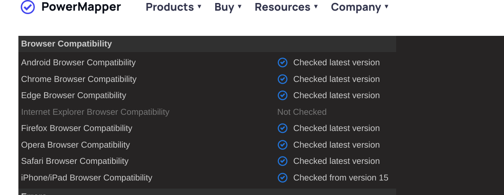

<h1> ROCK PAPER SCISSORS LIZARD SPOCK (PROJECT TWO) </h1>
As a developer, I want to make a Rock-Paper-Scissors game with HTML, CSS, and JavaScript so people can play and have fun.

Features: 
Simple User Interface: The game has easy-to-click buttons for Rock, Paper, and Scissors. It looks clean and simple because of CSS styling. 

Game Logic: JavaScript runs the game by checking the player’s choice against a random computer choice and deciding who wins. It also keeps track of the scores and shows them on the screen.

Immediate Feedback: After each round, the game shows what the player and computer picked and whether the player won, lost, or tied. It updates the scores right away.

Testing: Debugging: I used the console log tool in the browser to find and fix errors in the JavaScript code, like spelling mistakes and missing symbols that messed up the game.

Fixing File Links: A big problem was the game crashing because the JavaScript and CSS files weren’t linked right in the HTML. 
I deleted everything and started over twice before finding out it was just a linking error. Fixing the links made the game work properly.

Checking Functionality: I tested every part of the game, making sure the buttons worked, the right winner was shown, and the scores updated. I played through a bunch of rounds to be sure everything was right.

Tutor Help: My tutor, Patrick Rory, helped me a lot, showing me how to find bugs and reminding me to check things step by step. His help was really important in getting the game working.

Testing site responsiveness screenshots of the results of the tested screen sizes:

Screen responsive size for Monitor 1920x1080

Screen Responsive size for Tablet 1366x1024

Screen Responsive size for Mobile 360x 640

Testing validation (HTML, CSS, etc.), with accompanying screenshots. HTML Errors from W3 Validator

Error 1 :

Solution: I took deleted the space in the computer.

CSS Errors from W3 Vadidator

*NOTE : The reason for there are no errors shown is because this css file has been edited and deleted multiple times in the process of creating the program the error and functionality of its was being corrected and were unable to take note of the errors from the original fie stylesheet.css file .

Accessibility testing (using tools such as https://wave.webaim.org/), with accompanying screenshots.

5 Errors for Empty Buttons. Solution: I added aria label to each button with its name.

1 Alert for No page region: Solution: i added main section with in the html to compy with region error.

Browser testing with accompanying screenshots of each tested browser rendering the site.

This is a website called PowerMapper where it checks if your site is accessible on various web browsers. As you can see it has checked the compatibility of the following web browsers of various platforms.

Deployment:
This was deployed to Github page, the steps below were taken for deployment:
•	Opened Github
•	Selected my repository
•	Opened setting in the selected repository.
•	Went to github pages
•	Selected deploy source from none to main and save.
•	Then refreshed page went to deployment section on top. 
•	 the following link was given:
https://belawal.github.io/Rock-Paper-Scissors-Game/

Conclusion:
I encountered several issues that caused the game to malfunction. The main problems were numerous spelling errors in my JavaScript code, which prevented the game from properly registering player choices and updating the scores. Additionally, I had linking errors between my HTML, CSS, and JavaScript files, which meant the scripts and styles were not loading as intended. 
This caused further complications, like buttons not working correctly and the game's layout appearing broken. 
To resolve these issues, I utilized the console log method in the browser's inspect tool, which allowed me to debug the JavaScript code line by line. 
To fix these, I combed through each line of code, using console logs to pinpoint exactly where the code was failing. 

Despite these efforts, the game kept crashing at the very end, and I mistakenly believed the entire code was corrupted. In my frustration, I ended up deleting the entire set of files and starting over twice, only to later discover that the root of the problem was a simple linking error between my JavaScript file and the HTML. This oversight cost me a lot of time and effort, but it was a valuable lesson in the importance of checking file paths and links early on in the troubleshooting process.

This process helped me identify the specific lines where spelling mistakes were causing errors. My tutor, Patrick Rory, guided me through each step of troubleshooting, teaching me how to systematically check for errors and correct the links with his assistance, I was able to refine my code, fix the spelling mistakes, and ensure all files were correctly connected, ultimately getting my game to work as expected. In addition to the spelling errors and linking issues, I encountered several simple yet frustrating mistakes that added to my struggles.

For instance, I missed a few semicolons and parentheses in my JavaScript code, which caused unexpected behavior and errors that were not immediately obvious. There were also syntax errors like missing curly braces that broke the flow of my functions, but it was a valuable lesson in the importance of checking file paths and links early on in the troubleshooting process. Ultimately,I managed to fix the linking issues, and the game finally ran smoothly as intended.

